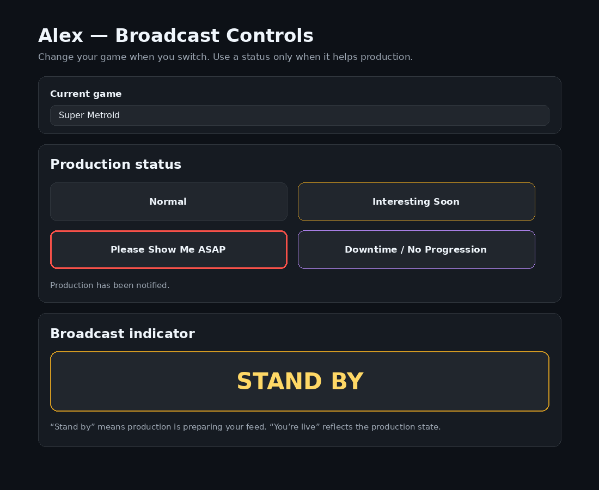
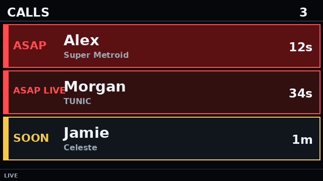
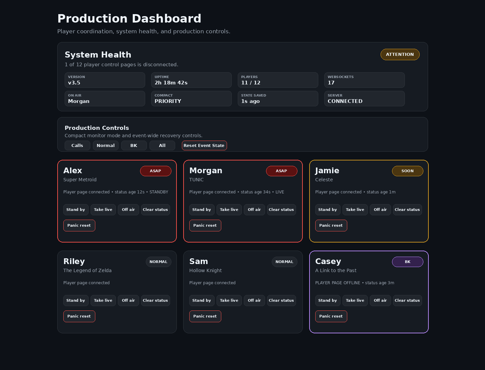

# Archipelago Broadcast Control

A lightweight coordination tool for [Archipelago](https://archipelago.gg/) multiworld broadcasts.

Players report their current game and whether something worth showing is coming up. Production gets that information in real time and can send Stand By / Live feedback back to the players.

## Screenshots

### Player Controls



### Compact Monitor



### Production Dashboard



## Features

- Player-selectable current game and production status
- Stand By, Live, and Off Air feedback
- Production dashboard and 640×360 compact call monitor
- HTTP endpoints for graphics and monitoring
- WebSocket control for production automation and Bitfocus Companion
- Persistent state across server restarts

## Installation

### Windows

Download the Windows x64 portable package from **Releases** and extract it. Node.js, npm, and Git are included or not required on the event computer.

1. Copy `config.example.json` to `config.json`.
2. Add the event roster, games, and player tokens.
3. Run `start-event.cmd`.
4. Enter the production admin key when prompted.

### From source

Node.js 18 or newer is required.

```bash
npm ci
```

Copy `config.example.json` to `config.json`, set `ADMIN_KEY`, then run:

```bash
npm start
```

The server listens on port `3000` by default.

## Configuration

`config.json` contains the player roster, assigned games, player tokens, and status definitions. A starting template is included as `config.example.json`.

Player links use the configured ID and token:

```text
http://SERVER-IP:3000/player.html?id=john&token=PLAYER_TOKEN
```

`config.json` is excluded from Git because it may contain authentication tokens.

## Documentation

- [API Reference](docs/api-reference.html)
- [Application Pages](docs/application-pages.html)

The application is intended for a trusted production network. Player links contain authentication tokens and should be treated as credentials.

## License

Archipelago Broadcast Control is licensed under the GNU General Public License v3.0. See [LICENSE](LICENSE) for the full text.
